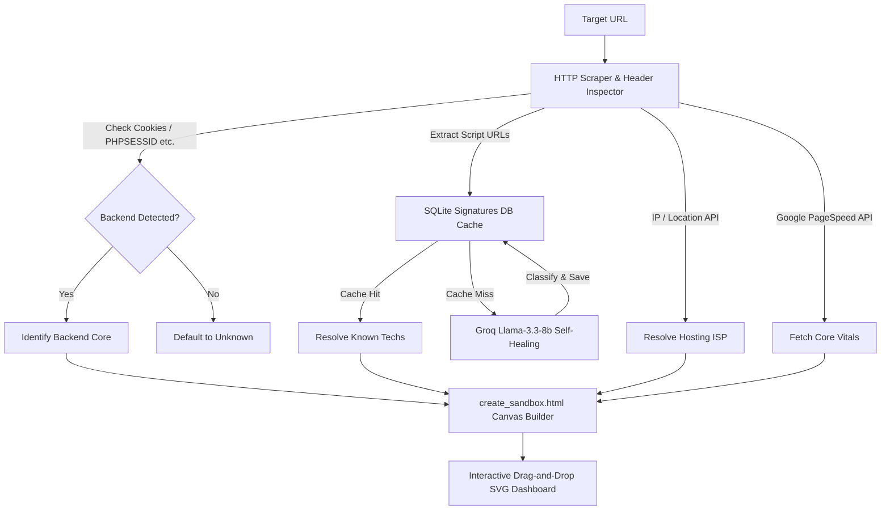

# 🛰️ Web Scout Agent Control Center

A self-healing, agent-driven website architecture scraper and system design visualizer. It analyzes any website's technologies, geo-location routing, and web performance, compiling them dynamically into an interactive drag-and-drop system design dashboard.

---

## 🎨 System Design Architecture Flow



---

## 🚀 Key Features

*   **Dual AI Engine Support:** Powered by Google's **Gemini 2.5 Pro** or **Llama 3.3 (via Groq)**. If you run out of Google free-tier daily quotas, the agent has a built-in zero-rate-limit alternative pipeline running on Groq.
*   **Cookie & Header Fingerprinting:** Scrapes Set-Cookie headers to identify backend architectures without assumptions (e.g. matching `PHPSESSID` $\rightarrow$ PHP Backend, `JSESSIONID` $\rightarrow$ Java Backend, `connect.sid` $\rightarrow$ Node.js).
*   **Self-Healing SQLite Cache:** Saves matched script signatures locally to `/app/signatures.db` (acting as a structured local RAG), eliminating redundant LLM queries.
*   **Local FastAPI Web Control Panel:** Serves a modern dark-mode dashboard to launch scans, watch diagnostic logs, and render the interactive canvas in an iframe safely.
*   **Automated LLM-as-a-Judge Evals:** A dedicated evaluation test suite (`app/groq_eval.py`) that runs test cases and scores performance using Llama 3.3.

---

## 🛠️ Getting Started

### 1. Installation
This project leverages [uv](https://github.com/astral-sh/uv) (a Rust-powered Python package manager) for ultra-fast, isolated dependency resolution.

Clone the repository and sync dependencies:
```bash
git clone <your-repo-url>
cd web-scout-adk
uv sync
```

### 2. Environment Setup
Copy the template environment file and insert your API keys:
```bash
cp .env.example .env
```
Open `.env` and fill in your keys:
*   `GEMINI_API_KEY`: Get a free key at [Google AI Studio](https://aistudio.google.com/).
*   `GROQ_API_KEY`: Get a free key at [Groq Developer Console](https://console.groq.com/).

### 3. Launching the Web UI
Start the local FastAPI server:
```bash
uv run python app/web_server.py
```
Open **[http://localhost:8080](http://localhost:8080)** in your browser, type a domain (e.g., `app.lokalise.com`), select your AI engine, and click **Launch Scanner**!

---

## 📊 Running Evaluations (Testing)

We validate agent behavior using an automated **LLM-as-a-Judge** harness. To run the test suite and output a terminal scorecard:
```bash
uv run python app/groq_eval.py
```
Detailed grade results are written to `artifacts/groq_eval_report.json`.
